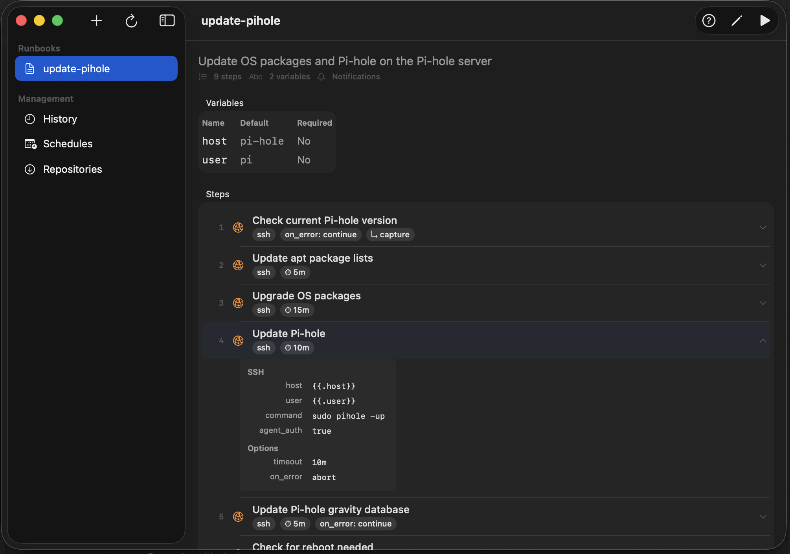
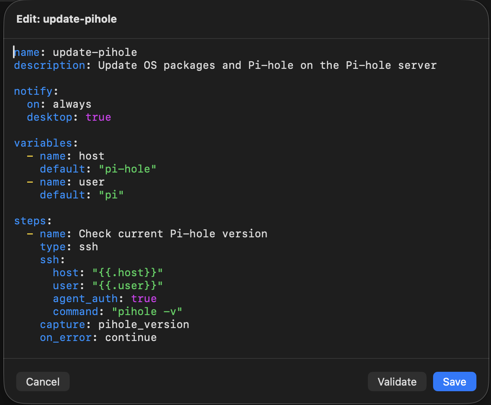

# Runbook Mac

Native macOS app for browsing, executing, and managing operational runbooks. A GUI frontend for the [runbook](https://github.com/msjurset/runbook) CLI tool.





## Features

- **Three-Panel Layout** — Sidebar for navigation, searchable runbook list with metadata, and runbook detail view
- **Runbook Detail** — View variables, steps with type icons, notification config, and recent run history at a glance
- **Expandable Steps** — Click any step to expand its full configuration (command, host, URL, headers, etc.)
- **Inline Editing** — Double-click any value in an expanded step to edit it in place. Single-line values edit inline. Multi-line commands (`shell.command`, `ssh.command`, `http.body`) open a syntax-highlighted popout editor with Bash/JSON highlighting; click outside, press Esc, or Cmd-W to save. The detail view refreshes live.
- **Code Block Viewer** — Multi-line shell and JSON values render as syntax-highlighted code blocks inline — muted palette in view mode, full-vibrancy colors in the popout editor. Wrapped lines hang-indent under the source's first non-whitespace column.
- **Console Tray** — Non-modal bottom-docked console for runbook execution. Launching a runbook never blocks the rest of the app: keep editing, navigate sidebar sections, and start additional runs concurrently. Tabs flex-grow to share the bar, each with a status icon (running/succeeded/failed/cancelled), runbook name, and × that stops + dismisses the run. Collapsible to a 1-line status strip; chevron toggles back. Stop and Retry sit in the output toolbar next to Copy All; an inline Dry checkbox next to Retry lets you flip the next run between real and dry without opening a sheet.
- **Concurrent Runs** — Multiple runbooks can run at the same time. Each gets its own tab in the tray; click any tab to switch which one's output is showing. Up to 5 terminal sessions are retained in the tab strip until dismissed.
- **In-place Retry** — Retry button on a finished session restarts the same tab — clears the previous output, resets the elapsed counter, and re-runs with the same vars. The Dry checkbox on the output toolbar lets you flip the mode for the retry.
- **Run Confirm Sheet** — The Run toolbar button always opens a small dialog: variable inputs (when the runbook declares any), a Dry Run checkbox, and Run / Cancel. Pre-fills with the runbook's defaults.
- **Runner Output** — Copy all output, search within output with match navigation, save logs, and syntax-highlighted output via configurable rules in `~/.runbook/highlights.yaml`
- **Auto-Logging** — Per-runbook log config with `new` (per-run file) and `append` (cumulative) modes; log viewer with section picker for append-mode files
- **YAML Editor** — Syntax-highlighted editor with color-coded keys, strings, booleans, numbers, comments, template expressions, and `op://` references
- **Auto-Complete** — Press Tab for context-aware YAML completions (top-level keys, step fields, type values, error policies)
- **Auto-Indent** — Smart indentation after colon-terminated lines
- **Templates** — Runbooks in `templates/` directories are shown separately with visual distinction; all discovered templates appear in the New Runbook dialog and as right-click actions
- **Pin Runbooks** — Pin frequently-used runbooks to the top of the list; persisted across sessions
- **Keyboard Navigation** — ⌘1-4 for sidebar sections, ⌘K to quick-jump to any runbook by name
- **Diff Preview** — Review changes before saving in the YAML editor
- **Run History** — Browse all past runs with expandable per-step results, timing, errors, and name filtering
- **Cron Scheduling** — Add, view, and remove crontab entries from the GUI. Each scheduled runbook shows a status dot (gray = never run, green = last succeeded, red = last failed), an inline "last run" badge (e.g. `✓ 5h ago`), and a live-updating "next run" line (e.g. `Next: Sunday at 8:00 AM · in 3d 2h`).
- **Repository Management** — Pull git repos or single YAML files, list, update, and remove pulled repos
- **SSH Key Caching** — Cache 1Password SSH keys in system keychain via `runbook auth` to avoid Touch ID prompts on repeat runs
- **Credential Pre-warm** — Settings button to run `goback auth` interactively, caching op:// secrets so cron jobs can read them from the locked keychain
- **Help System** — Menu bar Help (⌘?) with 14 topics + contextual ? button on each view
- **CLI Auto-Install** — Detects missing CLI on first launch and offers one-click install from GitHub Releases
- **CLI Auto-Update** — Checks for new CLI versions daily and shows non-blocking update notification
- **Validation** — Validate YAML structure without running via the CLI
- **Desktop Notifications** — Test notifications from the app

## Requirements

- macOS 15.0 (Sequoia) or later
- [runbook](https://github.com/msjurset/runbook) CLI installed and available in your `PATH`

## Install

### Homebrew

```sh
brew install --cask msjurset/tap/runbook-mac
```

This also installs the `runbook` CLI if you don't already have it.

### From source

```sh
make deploy
```

This builds the app, creates the `.app` bundle with icon, and installs to `/Applications/Runbook.app`.

## Build

```
make build                    # Compile release binary
make bundle                   # Build + create .app bundle
make icon                     # Generate app icon (if missing)
make release VERSION=1.2.0    # Bump version, commit, and tag
```

## Architecture

The Mac app is a **frontend** — it does not reimplement the runbook engine. All execution is delegated to the `runbook` CLI binary via `Process`:

- `runbook run --no-tui --yes <name>` for execution with live output streaming
- `runbook completion-names` for dynamic runbook discovery
- `runbook validate`, `runbook cron`, `runbook pull`, `runbook notify` for management

The shared contract between the app and CLI is:
- YAML runbook files in `~/.runbook/books/`
- Templates in `templates/` subdirectories (discovered but shown separately)
- JSON history records in `~/.runbook/history/`
- Run logs in `~/.runbook/logs/`
- Pinned runbooks in `~/.runbook/pinned.json`
- YAML backups in `~/.runbook/backups/` (created before every save and delete)
- Output highlighting rules in `~/.runbook/highlights.yaml`
- The `runbook` binary in `$PATH` or `~/.local/bin/`

## Project Structure

```
Sources/RunbookMac/
  Models/           Runbook, HistoryRecord (Codable structs)
  Services/         RunbookCLI (Process bridge), RunbookStore (file I/O + YAML), CronDescription
  Views/
    Sidebar/        Navigation sidebar, runbook list with search, browser split view
    Detail/         Runbook detail, runner with output controls, create-from-template
    Editor/         YAML editor with syntax highlighting + completion
    History/        Run history browser
    Settings/       Settings, cron and pull management, step flow visualization
    Help/           Help system with structured content
Tests/
  RunbookMacTests/  Unit tests (models, templates, cron, completions)
  UITests/          XCUITest UI tests (navigation, layout, selection)
```

## License

MIT
