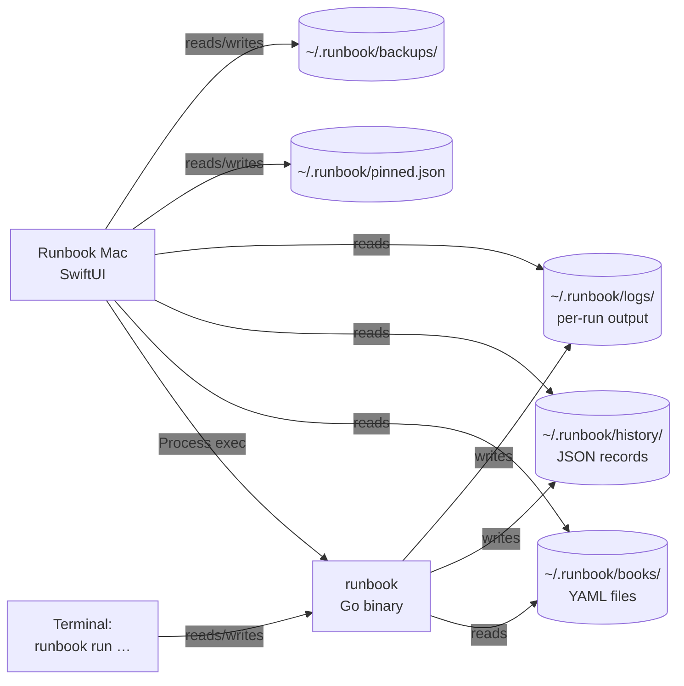
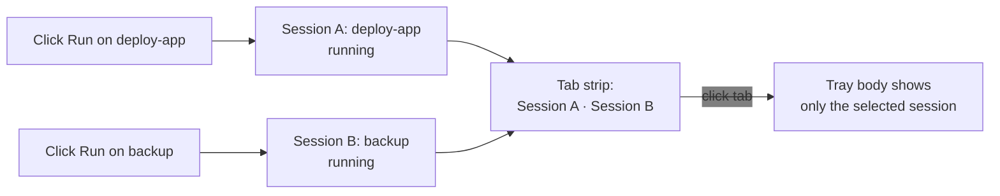

# Concepts

The mental model behind Runbook Mac. Read this once and the [Cookbook](03-cookbook.md) will feel like applied common sense.

This page is concept-first, not reference-first. Each section explains what's happening and **why**, then walks through a concrete example. The exhaustive lookup tables live in [Reference](04-reference.md). For the underlying YAML schema, step types, variable resolution, and on-disk semantics, see the [runbook CLI guide](https://github.com/msjurset/runbook/blob/master/docs/guide/02-concepts.md) — this page does not duplicate that material.

- [The frontend model](#the-frontend-model) — why the app is just a frontend
- [The three-panel layout](#the-three-panel-layout) — sidebar, list, detail
- [The console tray](#the-console-tray) — non-modal multi-run output
- [Sidebar sections](#sidebar-sections) — Runbooks, History, Schedules, Repositories
- [State on disk](#state-on-disk) — what lives where, who reads/writes it
- [The shared CLI contract](#the-shared-cli-contract) — what the app delegates and what it does itself
- [Templates and shared collections](#templates-and-shared-collections) — how the app surfaces them
- [Concurrent runs](#concurrent-runs) — multiple sessions, one tray
- [Output highlighting](#output-highlighting) — `~/.runbook/highlights.yaml`
- [Inline editing vs. the YAML editor](#inline-editing-vs-the-yaml-editor)

---

## The frontend model

Runbook Mac does not contain a runbook engine. There is no Swift code that knows how to dispatch an HTTP step, run an SSH command, or evaluate `on_error: retry`. Every time you click Run, the app shells out to the `runbook` CLI binary on disk:

```
runbook run --no-tui --yes <name> --var key=value …
```

It captures stdout/stderr line-by-line through a `Process` pipe, streams the lines into the console tray, and watches for the process to exit. That's it. The app is a UI for invoking the CLI — discovery, observation, and lifecycle management — without reimplementing what the CLI already does.

This is by design. It means:

- **One source of truth.** What the app does and what `runbook run` does on the command line are the same thing. There's no risk of the app drifting from the CLI's behavior because the app *is* the CLI's behavior, dressed up in panels.
- **Cross-tool consistency.** A schedule added via the cron UI is the same crontab line `runbook cron add` would have written. A pull from the Repositories pane is the same `runbook pull` invocation. History records, log files, the keychain cache — all produced and consumed through the CLI, all observable from the terminal.
- **Versioning is decoupled.** The Mac app and the CLI ship and version independently. Updating one doesn't force the other. The app checks for new CLI versions on launch (once per 24h) and prompts you to update the CLI when one is available.



Both the GUI and the terminal observe the same files. Open the app and the terminal side-by-side; the History view in the GUI updates the moment a terminal-launched run completes (after `↻ Refresh` or auto-refresh).

---

## The three-panel layout

The main window is a [`NavigationSplitView`](https://developer.apple.com/documentation/swiftui/navigationsplitview) — three panels, left to right:

| Panel | Width | Purpose |
|-------|-------|---------|
| Sidebar | ~200pt | Section navigation: Runbooks, History, Schedules, Repositories |
| List | ~280pt (resizable) | When section = Runbooks: the searchable list of every discovered runbook + templates section |
| Detail | flex-fill | The selected runbook's variables, steps, notify config, and recent runs — or the History/Schedules/Repositories pane when a different sidebar section is selected |

The list panel is **only visible** for the Runbooks section. When you switch the sidebar to History, Schedules, or Repositories, the list panel collapses and the chosen section's view fills the right side.

Below all three panels is the **console tray** — see [the next section](#the-console-tray).

### Why three panels (not a tab bar or a sidebar+window)

Runbooks share their list panel with their detail panel for a reason: you spend most of your time bouncing between "browse the list, pick one, look at it, run it, browse another." The split keeps both visible. Compare to a tab-bar approach where each runbook would consume window real estate; or a sidebar-only approach where the list and the detail compete. Three panels is the right shape for the workflow.

The other sections (History, Schedules, Repositories) don't have that "browse-then-detail" pattern as strongly — History is itself a list with inline detail expansion; Schedules is a list with inline edit; Repositories is a flat table. They get the full detail-panel width and skip the middle list.

---

## The console tray

The tray is a **bottom-docked, non-modal panel** that appears the moment a run starts and hides when no run is active. It's not a sheet, not a modal — you can keep using the rest of the app while runs are streaming into it.

Two states:

- **Collapsed:** a single-line status bar at the bottom showing the current session's name, status icon, and elapsed time. Click anywhere to expand.
- **Expanded:** the full output area with a tab strip at the top, the streamed output in the middle, and a toolbar at the bottom (Find, Copy, Stop, Retry, Save).

### One tray, multiple sessions

The tray shows **one** session at a time, but `RunSessionStore` (the in-memory store backing the tray) tracks **all** active and recently-completed sessions:



The tab strip lets you switch focus between concurrent runs. Each tab has its own status icon, elapsed timer, and `×` to stop+dismiss. The store retains up to **5 terminal sessions** (succeeded/failed/cancelled) so you can revisit recent output without losing it; the 6th terminal session pushes the oldest out.

### The dry checkbox is on the toolbar, not the tab

When a session terminates, the toolbar grows two new affordances: a **Retry** button and a **Dry** checkbox right next to it. The checkbox flips the next retry between real and dry-run **without** opening a sheet or creating a new tab. Click Retry; the same tab clears its previous output, resets the elapsed timer, and re-runs with the new dry/real choice. The session ID stays the same — history records and log paths line up with the original session's lineage.

This is the right shape for the most common iteration pattern: "I just ran this and it failed; let me dry-run it to see what would happen." Without leaving the tray, you flip the checkbox and click Retry.

---

## Sidebar sections

Four top-level sections, each with its own pane in the right side of the window. The sidebar is your switchboard.

### Runbooks

The default section. Browse, run, edit, schedule, pin, duplicate, delete. The list panel shows every YAML file discovered under `~/.runbook/books/` (and one level into subdirectories — same discovery rules as the CLI). Templates appear in a separate collapsible section below the regular runbooks.

The detail panel shows the selected runbook's structure: variables (in a grid), steps (expandable for full config), notify config, log config, and the last 5 runs at the bottom.

### History

Every run, ever — newest first. Filter by runbook name with the search field at the top. Click a row to expand it; click a step inside the expanded row to expand **that** step and load its log slice. "View Full Log" opens the full log file in a separate sheet with run-section navigation (for append-mode logs).

The History view uses a `ScrollView` + `LazyVStack` instead of a `List`. The reason: macOS `List` caches row heights and leaves a phantom gap when an expanded row collapses. With dynamic-height per-step log expansions, that gap was ugly. `ScrollView` + `LazyVStack` re-measures correctly. (Trade-off: no built-in selection or swipe affordances. Acceptable for a read-only view.)

### Schedules

The cron UI. Each scheduled runbook shows up as a row with:

- **Status dot** — gray (never run), green (last run succeeded), red (last run failed). Computed from the most recent history record matching the runbook name.
- **Runbook name + last-run badge** — `✓ 5h ago` / `✗ 2d ago` / `Never run`. The badge updates when new history records arrive.
- **Cron expression + human-readable description** — `0 3 * * 0` rendered as "Every Sunday at 3:00 AM" via `CronDescription.describe()`.
- **Next-run line** — `Next: Sunday at 8:00 AM · in 3d 2h`. Computed via `CronNextRun.next()` and a relative-time formatter; updates live on a timer.
- **Step flow chart** — see the next subsection.

Buttons on the row: Edit (inline), Delete, plus a chevron to expand the step flow chart.

#### The step flow chart

A custom SwiftUI `Canvas` rendering of the runbook's steps as boxes connected by arrows — not HTML, not SVG, not Mermaid, just `context.draw` calls. The drawing pipeline took some care to get right, so the rest of the app is conservative about touching it:

- Each step is a rounded rectangle, **colored by step type**: shell = blue, ssh = orange, http = green, confirm = gray. A color legend is always rendered below the chart for reference.
- **Click** a step box → flyout showing that step's full config (command, host, URL, headers, options).
- **Right-click** a step box → flyout showing the **last run's log slice** for that step (loaded asynchronously via `StepLogExtractor`).
- **Double-click** a step box → navigates to the runbook detail view with that step pre-expanded. Internally this fires a `NotificationCenter.runbookNavigateToStep` notification, the sidebar switches to Runbooks, the detail view scrolls to and expands the matching step.

The flyout positioning anchors to the **center of the clicked pill** — `.popover(isPresented:arrowEdge:)` is applied *before* `.position`, so the popover sees the inner pill-sized frame, not the full canvas frame.

### Repositories

The pull-management UI. List of pulled collections, each with its repo name, runbook count, and Update / Remove buttons. A "Pull New Repository" button at the top opens a sheet for entering a git URL. Single-file pulls work too — paste a `.yaml` URL and the pull command auto-detects the file form.

This is just a GUI for `runbook pull`. Anything you do here, you could do from the terminal with the CLI. The point is the live overview: at a glance, what collections do I have, when did they last update, how many runbooks does each one ship.

---

## State on disk

The app reads and writes to a small set of well-known paths under `~/.runbook/`. Everything is human-readable JSON or YAML; the CLI uses the same locations.

| Path | Format | Written by | Read by |
|------|--------|-----------|---------|
| `~/.runbook/books/*.yaml` | YAML | App (editor saves), CLI (`runbook create`, `runbook pull`) | App (discovery), CLI (`runbook run`) |
| `~/.runbook/books/<repo>/` | git checkouts of pulled collections | CLI (`runbook pull`) | App (discovery), CLI |
| `~/.runbook/books/**/templates/` | YAML | User (manually), pulled collections | App (template list), CLI (`runbook list --templates`) |
| `~/.runbook/history/*.json` | JSON, one record per run | CLI (every run) | App (History view, Recent Runs section, Schedules status dot) |
| `~/.runbook/history/<name>.log` | plain text, append-only | CLI (cron-launched runs only) | App (History per-step log slices) |
| `~/.runbook/logs/*.log` | plain text | App (`RunSessionStore.persistLog`), CLI (when YAML has `log: enabled`) | App (History per-step log slices, Log Viewer sheet) |
| `~/.runbook/logs/index.json` | JSON | App, CLI | App (`StepLogExtractor.findLogURL`) |
| `~/.runbook/logs/archive/` | rotated `.log` and `.gz` files | external rotators | App (log resolution) |
| `~/.runbook/pinned.json` | JSON array of names | App (when you toggle a pin) | App (list ordering) |
| `~/.runbook/backups/` | timestamped copies of YAML | App (before every save and delete) | manual recovery |
| `~/.runbook/highlights.yaml` | YAML rules list | user (manually) | App (`OutputHighlighter`) |

The app **never writes** to `~/.runbook/history/` directly. History is the CLI's responsibility. The app only reads.

The app **does write** to `~/.runbook/logs/` — specifically, when the app launches a run, `RunSessionStore.persistLog` captures the streamed output to a per-run file at the end of the session. This is in addition to whatever the CLI's YAML `log:` block writes (if configured). The duplication is harmless; the LogIndex points at one of them.

### Backups

Before every save and every delete in the YAML editor, the current file is copied to `~/.runbook/backups/<name>-<timestamp>.yaml.bak`. There's no automatic cleanup; the directory grows. To prune: it's just a directory of files — `find ~/.runbook/backups -mtime +30 -delete` or similar.

The backups give you a safety net when you save something accidentally — pull the previous version out of the backups dir and overwrite. There's no in-app "restore from backup" UI; the directory is intentionally just files for terminal-driven recovery.

---

## The shared CLI contract

The app delegates to the CLI for these operations:

| GUI action | CLI invocation |
|-----------|----------------|
| Click Run on a runbook | `runbook run --no-tui --yes <name> --var k=v …` |
| Click Dry Run / toggle Dry checkbox | adds `--dry-run` to the above |
| Click Validate in editor | `runbook validate <path>` |
| Add a schedule | `runbook cron add <name> "<schedule>"` |
| Remove a schedule | `runbook cron remove <name> "<schedule>"` |
| Pull a repo | `runbook pull <url>` |
| Refresh repo list | `runbook pull list` |
| Remove a repo | `runbook pull remove <name>` |
| List runbook names (for completion, Quick Jump) | `runbook completion-names` |
| Test desktop notification | `runbook notify-test <name> [--fail]` |

The app **does not delegate** for these — it does them in Swift directly:

- **Discovery and parsing** of YAML files (it reads `~/.runbook/books/` itself for the list and detail views; that's separate from the CLI's discovery, but they share the same file-layout rules).
- **History reading** (it reads `~/.runbook/history/*.json` directly).
- **Log file resolution and parsing** (it reads `~/.runbook/logs/` and parses the run-section markers in its own code; the CLI doesn't expose this).
- **Pinning** (`pinned.json` is app-only state).
- **YAML editing, syntax highlighting, completion, diff** (the CLI doesn't have a built-in editor).
- **Cron schedule visualization** (`CronDescription`, `CronNextRun` — derived from the crontab line, computed in Swift).

The split is deliberate: anything that's a *side effect on the world* (running, scheduling, pulling) goes through the CLI so the GUI and the terminal stay in lock-step. Anything that's *just a view* over already-on-disk state can be done in Swift faster than spawning a subprocess for every refresh.

---

## Templates and shared collections

The Mac app surfaces both the CLI's [pulled-collection mechanism](https://github.com/msjurset/runbook/blob/master/docs/guide/02-concepts.md#pulled-collections-and-shared-templates) and its templates feature with dedicated UI:

- **Templates** appear in their own collapsible section at the bottom of the Runbook List, visually distinct (orange "template" badge). Right-click a template → "New from Template" opens a sheet that pre-fills the editor with the template's YAML and asks for a new name. The toolbar's `+` button opens the same sheet with a template picker on the left.
- **Pulled repositories** show up as a directory under `~/.runbook/books/`. Their contents (regular runbooks and any `templates/` subdirectories inside them) are discovered and surface in the Runbook List and Templates section just like any local file.
- **The Repositories sidebar section** is the management UI: pull a new repo, refresh existing pulls, remove, and see the runbook count per repo at a glance.

When you pull a collection that ships templates (`<repo>/templates/...`), they automatically appear in the Templates section of the Runbook List. Anyone with the repo pulled can scaffold new runbooks from the same templates — the right shape for a team standardizing on shared patterns.

---

## Concurrent runs

The `RunSessionStore` is the in-memory state behind the tray. Its model is straightforward:

- `sessions: [RunSession]` — newest first; running and recently-terminal both live here.
- `currentID: UUID?` — which session the tray is showing.
- `runTasks: [UUID: Task<Void, Never>]` — the in-flight subprocess wrappers, keyed by session ID.

When you click Run, the store:

1. Inserts a new `RunSession` at the top of `sessions`.
2. Sets `currentID` to that session.
3. Spawns a `Task` that calls `RunbookCLI.shared.run(...)`, streaming each output line back to the session via `append(line, to: sessionID)`.
4. On completion (success/failure/cancellation), sets the session's terminal state, persists the captured output to a log file via `persistLog`, and calls `pruneTerminal` to enforce the 5-session retention cap.

Multiple sessions can be active at once. Each runs in its own `Task`, with its own subprocess, its own captured output, and its own cancellation handle. The tab strip in the tray is just a UI projection of `sessions` filtered by ID.

When a session terminates and `persistLog` runs, the captured output is written to `~/.runbook/logs/<name>-<timestamp>.log` and registered in `LogIndex` so the History view can find it later. This is why History shows actual log content even for runs that the user kicked off from the GUI without `log: enabled` configured in YAML — the GUI persists logs unconditionally.

---

## Output highlighting

Every line of streamed output goes through `OutputHighlighter.color(for: line)` before it's rendered. The highlighter loads rules from `~/.runbook/highlights.yaml`:

```yaml
rules:
  - pattern: '(?i)error|failed|fatal'
    color: red
    bold: true
  - pattern: '(?i)warn'
    color: orange
  - pattern: '(?i)success|done|ok|200'
    color: green
  - pattern: '✓|✗|⊘'
    color: gray
```

Each rule has a regex `pattern`, a `color` (named — red/green/blue/orange/yellow/purple/cyan/gray/white/pink/teal — or hex `#RRGGBB`), and an optional `bold` flag. First-match wins per line. If the file is missing, the highlighter falls back to a sensible built-in default.

The highlights are used in three places:

- **Console tray** — live output from active runs.
- **History view** — the per-step log slices loaded on demand.
- **Log Viewer sheet** — the full-file viewer reachable from "View Full Log" in History.

Same rules apply everywhere. Edit the file with any text editor; changes apply on next render (the file is read on demand, no app restart needed).

---

## Inline editing vs. the YAML editor

There are two ways to modify a runbook from the app:

**Inline editing** in the runbook detail view — expand a step, double-click a value, edit in place, blur to save. Useful for quick tweaks: changing a host, swapping a command, flipping `on_error`. Single-line values edit inline; multi-line shell commands open a popout editor with Bash syntax highlighting (Cmd-W or click outside to save).

**Full YAML editor** — pencil button in the toolbar opens the editor sheet. Syntax highlighting, Tab completion (top-level keys, step types, error policies, etc.), auto-indent, validation via `runbook validate`, and a **diff preview** before save (old vs. new, side-by-side, click Save to confirm). The right shape for structural changes — adding steps, restructuring vars, rewriting a notify block.

Both write to the same YAML file and trigger the same `store.loadAll()` refresh. Edit history is preserved as `.bak` files in `~/.runbook/backups/`.

The inline path is faster for one-field changes; the editor is safer for everything else. The diff preview in particular is the difference between "I think I made the right change" and "I can see exactly what I changed before committing it." Use the editor any time you're not 100% sure.

---

## Where to go next

- [Cookbook](03-cookbook.md) — concrete recipes for every UI surface.
- [Reference](04-reference.md) — keyboard shortcuts, file locations, settings.
- [Troubleshooting](05-troubleshooting.md) — symptom-driven fixes.
- [Running as a Service](06-running-as-a-service.md) — Login Items, scheduling, log management.
