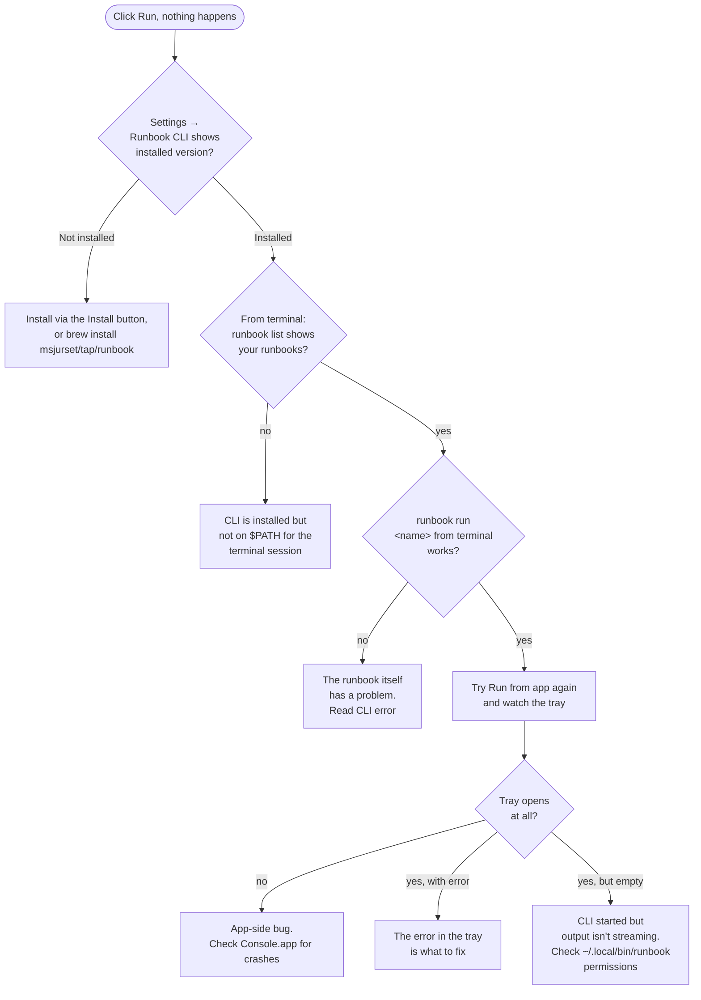
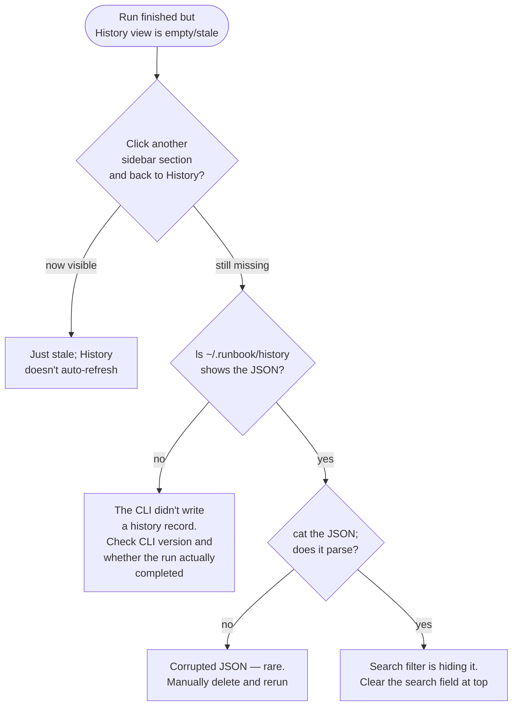
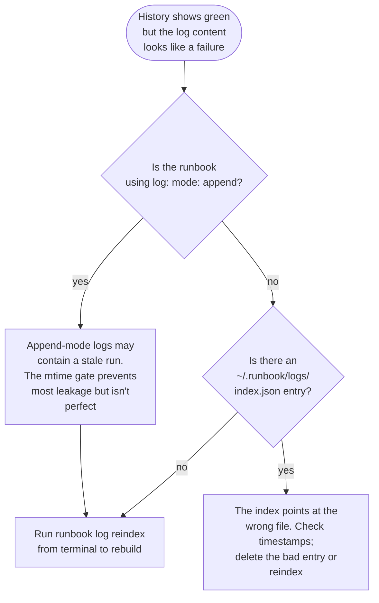

# Troubleshooting

When Runbook Mac isn't doing what you expect, this is the first place to look.

The fastest path to a fix usually goes through three artifacts: the **history record** (what `runbook` decided to do), the **log file** (what the steps actually printed), and the **CLI directly from a terminal** (does the same command work outside the GUI?). Most reports here boil down to combining those three.

For underlying CLI issues (1Password failures, SSH auth, condition templates not rendering, etc.), see the [runbook CLI Troubleshooting guide](https://github.com/msjurset/runbook/blob/main/docs/guide/05-troubleshooting.md).

- [Decision trees](#decision-trees) — guided diagnostics for the biggest categories
  - [The app launches but I can't run anything](#the-app-launches-but-i-cant-run-anything)
  - [A run completed but History doesn't show it](#a-run-completed-but-history-doesnt-show-it)
  - [The wrong log content shows for a run](#the-wrong-log-content-shows-for-a-run)
- [Symptom → fix entries](#symptom--fix-entries)
- [Platform-specific gotchas](#platform-specific-gotchas)
- [Filing a useful bug report](#filing-a-useful-bug-report)

---

## Decision trees

### The app launches but I can't run anything

The key triage: **does `runbook run <name>` work from a terminal?** If yes, the GUI is the problem; if no, the runbook is. The app fault-tolerates almost everything to "show the error in the tray," so the tray is your first source of truth.

### A run completed but History doesn't show it

The History view loads `~/.runbook/history/*.json` files on every navigation. It does not have a live watcher — switching away from History and back is the refresh.

### The wrong log content shows for a run

This was the bug the per-run log persistence (added 2026-04-28) was designed to prevent. Older runs from before that change may still show stale content because no proper index exists for them.

---

## Symptom → fix entries

### "Runbook CLI not installed" on first launch

**Cause:** the app couldn't find `runbook` on `$PATH` or in any of the standard install locations (`~/.local/bin`, `~/go/bin`, `/usr/local/bin`, `/opt/homebrew/bin`).

**Fix:**

1. **Click Install** in the CLI Setup sheet. The app downloads and installs in place.
2. **Or, install manually:** `brew install msjurset/tap/runbook` from a terminal, then click Done in the sheet.
3. **If neither works:** verify your `$PATH` includes one of the standard install locations. Settings → Runbook CLI → Check for Updates re-runs the detection.

**Notes:** the install download comes from the GitHub Releases API. If your network blocks GitHub, the install will fail visibly. Use the Homebrew path or download the release tarball manually from a different network.

---

### Runs are slow to start

**Cause:** every Run click spawns a new `runbook` subprocess. On the first run after a fresh launch, there's a one-time penalty for the CLI to initialize (load configs, scan books, etc.). After that, subsequent runs reuse the binary on disk but still have a per-process cold-start cost.

**Fix:** the cost is unavoidable but small (~50–200ms). If runs feel chronically slow:

- Check the CLI version (Settings → Runbook CLI). Older versions had longer startup paths.
- Check disk activity. A laggy disk slows the YAML scan.
- The app does its discovery in Swift (independent of the CLI's startup), so a slow `runbook list` doesn't directly slow the app's UI — but the Run button does spawn a real CLI process.

---

### "RunbookCLI: failed to start: file not found"

**Symptom:** clicking Run shows this error in the tray.

**Cause:** the `runbook` binary's path was correct at app launch but moved or got deleted while the app was running.

**Fix:** Settings → Runbook CLI → Check for Updates. The app re-detects the CLI's location. If still missing, reinstall via the Install button.

---

### History view is empty even though I just ran something

**Causes (in order of likelihood):**

1. **Stale view.** Click another sidebar section and back to History — it re-reads `~/.runbook/history/*.json` on every navigation but doesn't watch the directory.
2. **The CLI didn't write a history record.** Check `~/.runbook/history/` directly. If empty, the CLI is the issue — perhaps the run was terminated before the record write, or the CLI crashed.
3. **The search filter is hiding it.** Clear the search field at the top of the History view.

---

### Per-step expansion shows "Loading…" forever

**Cause:** `StepLogExtractor.findLogURL` couldn't resolve a log file for the run. Either:

- The run is older than the per-run log persistence (added 2026-04-28) and there's no log file on disk for it.
- The log file existed but got rotated/deleted/moved without `runbook log reindex` running afterward.
- The mtime gate rejected the only candidate file because it's too old to plausibly contain the run.

**Fix:**

- For old runs: there's nothing to load. The history record exists, but the actual output is gone. Future runs will work.
- For rotated logs: `runbook log reindex` from a terminal rebuilds the index from `~/.runbook/logs/` and `~/.runbook/logs/archive/`.

**Notes:** "Loading…" stays forever (no timeout) — there's no error message because not having a log isn't an error per se. If you want to know whether a file should exist, check `~/.runbook/history/<the-run>.json` for the timestamp and look for a corresponding file under `~/.runbook/logs/`.

---

### Step shows green but the log slice content is from a different run

**Cause:** classic stale append-mode log leakage. The log file path resolved correctly, but the run-section parsing didn't find a marker matching this history record's timestamp, so it fell back to ordinal positioning — and got the wrong section.

**Fix:**

1. **First, confirm:** is the runbook using `log: mode: append`? If so, multiple runs share one file.
2. **Run `runbook log reindex`** from a terminal. The index is the most reliable resolver; rebuilding it from disk fixes most cases.
3. **Check the file's timestamps:** `ls -la ~/.runbook/logs/<name>.log`. If the mtime is from a different run than the history record's `started_at`, the mtime gate may have rejected this file (correctly) and used a different fallback.

**Notes:** the per-run log persistence (added 2026-04-28) writes per-run files, not append-mode files — so newer runs don't suffer from this. The fix is primarily relevant for older runs and for runbooks that explicitly use `log: mode: append`.

---

### Schedules view is empty even though I have crontab entries

**Cause:** the Schedules view only shows entries managed by `runbook cron` — those are tagged with `# runbook: <name>` in the crontab. Manually-installed crontab entries (without that tag) are invisible to runbook and to the Schedules view.

**Fix:**

- Run `crontab -l` from a terminal to see the raw crontab.
- For each entry you want runbook to manage, remove it manually and re-add via `runbook cron add <name> "<schedule>"` (or via the Schedules view's Add Schedule button).

**Notes:** runbook is deliberately conservative about other crontab entries. It won't manipulate lines without its own tag.

---

### Schedules view says "Never run" but the schedule fires

**Cause:** the status dot and last-run badge are computed from history records. If your scheduled runbook isn't writing history records (e.g., you're on a very old CLI version, or the runs are failing before the history write), the badge stays "Never run" even though `tail -f ~/.runbook/history/<name>.log` shows fresh output.

**Fix:**

- Update the CLI to the latest version (Settings → Runbook CLI → Check for Updates).
- Verify the cron-launched run actually produces a history record: `ls -la ~/.runbook/history/ | head`. The most recent JSON should be from the latest cron tick.
- If the run is failing before the history-write step, fix the run failure first. The history write is durable but only happens at the *end* of a run.

---

### Step flow chart shows nothing on right-click

**Cause:** the right-click action loads the most recent log slice for the clicked step. If no log file exists yet (first time the schedule has been viewed before any runs), the flyout shows "no log entries for this step."

**Fix:** wait for the schedule to fire at least once, or run the runbook manually first. The right-click flyout has nothing to show until then.

---

### Pull failed: "git: command not found"

**Cause:** the CLI shells out to `git` for repo pulls. If git isn't installed, the pull fails.

**Fix:**

- macOS: `xcode-select --install` (gives you the Apple-shipped git) or `brew install git`.
- The CLI's augmented PATH includes the standard locations where these install, so once git is on disk it should be found automatically. If not, add the directory to your `$PATH` and relaunch the app.

---

### Pull failed: authentication error

**Cause:** the repo requires SSH or token auth and your environment doesn't have the credentials.

**Fix:**

- **For SSH-based remotes** (`git@github.com:...`): ensure `ssh-add -l` shows your key. Restart the app after adding to the agent if needed.
- **For HTTPS remotes** with token auth: configure git credential helper (`git config --global credential.helper osxkeychain` on macOS) and prime the cache by doing one `git clone <url>` from a terminal first.
- **For private repos:** the GUI doesn't have a "username/password" prompt. Use the terminal's git tooling for the initial credential setup; after that, the GUI's pulls succeed via the cache.

---

### YAML editor: phantom dropdown popup

**Cause:** the editor uses a custom `NoAutoFillTextField` (a subclass of `NSTextField`) that disables macOS autofill / auto-completion / inline-prediction explicitly at three lifecycle points. If you see a phantom popup, it's a regression — most likely an `inlinePredictionType` on the field editor wasn't set to `.no` (macOS 14+ added a separate inline-prediction popup that the older auto-* flags don't suppress).

**Fix:** report it. Check `Sources/RunbookMac/Views/FilterField.swift` for the `NoAutoFillTextField` recipe — the diff against a working app's version usually shows the missing flag.

**Notes:** this is a known macOS hostility issue. SwiftUI's standard `TextField` *cannot* be made to suppress these popups; the `NoAutoFillTextField` is the canonical workaround used everywhere in the app.

---

### Inline edit doesn't persist

**Cause:** the inline edit committed (you saw the field blur and value change) but the disk write failed. Check Console.app for permission errors on `~/.runbook/books/<name>.yaml`.

**Fix:**

- Ensure the YAML file is writable: `ls -l ~/.runbook/books/<name>.yaml` should show your user as the owner with write permission.
- If the file is in a pulled repo (`~/.runbook/books/<repo>/`), edits create local divergence that breaks the next `runbook pull` (which uses `git pull --ff-only`). Either commit/stash upstream or move the runbook out.

**Notes:** the previous version is in `~/.runbook/backups/` regardless — the backup happens before the write attempt. Recover from there if needed.

---

### Editor's Validate button says it's not installed

**Cause:** the validator delegates to `runbook validate <path>`, so it requires the CLI binary. If the CLI isn't installed (or moved), Validate fails.

**Fix:** Settings → Runbook CLI → Check for Updates (re-detects), or click Install if it's missing.

---

### Diff sheet: "no changes detected" but I edited the YAML

**Cause:** whitespace-only changes (trailing whitespace, line endings, indentation that's semantically equivalent). The Diff sheet uses string comparison, so identical-looking-but-bytewise-different content still triggers it. If you really see "no changes" after typing characters, the buffer didn't update — likely a focus issue.

**Fix:** click in the editor and re-save. If it persists, close the editor and reopen.

---

### Console output is unreadable colors

**Cause:** your `~/.runbook/highlights.yaml` rules paint everything with low-contrast colors against your current theme.

**Fix:**

- Edit `~/.runbook/highlights.yaml` to use better-contrasting colors. The Console renders in both Light and Dark mode using the system color appearance for each named color (red, green, etc.) — those should adapt automatically. Custom hex colors (`#XXYYZZ`) don't adapt; pick contrasting hex pairs or use named colors.
- Delete the file entirely to fall back to the built-in defaults.

---

### Pre-warm button is grayed out

**Cause:** the goback CLI is not installed. The Pre-warm button calls `goback auth`, not `runbook auth`.

**Fix:**

- For 1Password secret pre-warming, use `runbook auth <name>` from a terminal — that's per-runbook and doesn't require goback.
- If you specifically want the goback flow: `brew install msjurset/tap/goback`, then the button enables.

---

### "Permission denied" when writing to the runbook directory

**Cause:** the configured runbook directory isn't writable by your user.

**Fix:** Settings → Runbook Directory → click Browse and pick a directory you can write to. Or `chmod`/`chown` the existing directory.

**Notes:** if you're storing runbooks on an external volume or network mount, file permissions can be unusual. macOS sometimes shows the volume as writable but the OS-level access control is more restrictive.

---

## Platform-specific gotchas

### macOS

- **Full Disk Access for cron.** Modern macOS sandboxes the cron daemon's access to user directories. To let cron-launched runbooks write to `~/.runbook/`, grant Full Disk Access to `cron` itself (System Settings → Privacy & Security → Full Disk Access → click `+` → navigate to `/usr/sbin/cron`). Without this, scheduled runs install but never fire successfully.

- **Touch ID prompts on first secret resolution.** Any runbook with `op://` references triggers Touch ID the first time. Pre-warm via Settings → Credentials (or `runbook auth <name>`) to front-load the prompt before scheduling.

- **Login Items for auto-launch.** To start Runbook Mac at login: System Settings → General → Login Items → click `+` → select `Runbook.app`. The app itself doesn't have a "launch at login" toggle in Settings.

- **`/usr/sbin/cron` vs. `/etc/launchd.conf`.** macOS has both; the runbook CLI uses `/usr/sbin/crontab` for `runbook cron`. If you use `launchd` for scheduling instead (more macOS-native), the Schedules view won't see those entries — they're in plists, not in crontab.

- **Quarantine on first launch.** macOS may flag the downloaded app as quarantined. Right-click the app and choose "Open" the first time to bypass Gatekeeper, or run `xattr -d com.apple.quarantine /Applications/Runbook.app`.

### Linux / Windows

The Mac app is macOS-only. For Linux and Windows, run `runbook` from the terminal and use the [CLI guide](https://github.com/msjurset/runbook/tree/main/docs/guide).

---

## Filing a useful bug report

If you've worked through the relevant decision tree and symptom entry without finding a fix, gather this information before opening an issue:

1. **Versions.** Runbook Mac version (About menu) + CLI version (Settings → Runbook CLI).
2. **macOS version** (Apple menu → About This Mac).
3. **What you tried.** Step-by-step reproduction.
4. **What you expected vs. what actually happened.** One sentence each.
5. **The relevant runbook YAML** (sanitized — replace any `op://` references and hostnames you'd rather not share).
6. **History record** for the run that misbehaved: `cat ~/.runbook/history/<run>.json`.
7. **Log file** snippet (last 50 lines): `tail -50 ~/.runbook/logs/<name>.log`.
8. **Console.app output** for the Runbook process during the misbehavior, if the app crashed or hung.

A reproducer plus the history record usually closes the loop in one round.

File at https://github.com/msjurset/runbook-mac/issues.
