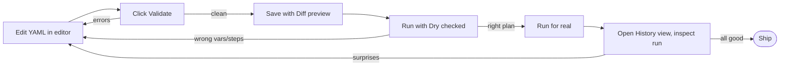

# Thinking in Runbook Mac

The other pages teach you what the app *can* do. This page is about how to use it well: when to reach for the GUI vs. the terminal, the design philosophy that informs the app's shape, workflow patterns that recur in good day-to-day use, and anti-patterns to avoid.

Read this once you've worked through [Getting Started](01-getting-started.md), [Concepts](02-concepts.md), and at least skimmed the [Cookbook](03-cookbook.md).

- [Design philosophy: frontend, not engine](#design-philosophy-frontend-not-engine)
- [When to use the app vs. the CLI directly](#when-to-use-the-app-vs-the-cli-directly)
- [Workflow patterns](#workflow-patterns)
- [Anti-patterns](#anti-patterns)
- [What the app intentionally doesn't do](#what-the-app-intentionally-doesnt-do)

---

## Design philosophy: frontend, not engine

The single most important thing to internalize about Runbook Mac is that it does not contain a runbook engine. There is no Swift code that knows how to run an SSH command or evaluate `on_error: retry`. Every run, every cron entry, every pull is delegated to the `runbook` CLI binary on disk.

This decision shapes everything:

- **One source of truth.** What the app does and what `runbook run` does in a terminal are the same thing — because the app *is* the CLI, dressed up in panels.
- **Cross-tool consistency.** A schedule added in the Schedules view is the same crontab line `runbook cron add` writes. A pull from the Repositories pane is the same `runbook pull` invocation. Both surfaces observe and modify the same files.
- **Versioning is decoupled.** The Mac app and the CLI ship and version independently. The app prompts you to update the CLI when one is available; updating the app doesn't force a CLI update or vice versa.
- **Extensibility lives in the CLI.** A new step type, a new error policy, a new YAML field — those land in the CLI first. The app picks them up automatically (via discovery) or after a small UI change. The right place to add features is the engine, not the GUI.

The corollary: if you're frustrated with the app's behavior, the question to ask is "is this an app problem or a CLI problem?" Test the same operation from the terminal. If it has the same behavior, it's a CLI problem and the fix is in the CLI repo. If it's different, it's the app's UI layer.

---

## When to use the app vs. the CLI directly

Both surfaces work on the same files. Pick whichever fits the task at hand.

### Use the app when

- **Authoring or editing runbooks.** The YAML editor — syntax highlighting, completion, validation, diff preview before save — is dramatically better than `vim` for the iteration cycle. Inline editing on the detail view is even faster for one-field tweaks.
- **Browsing.** The runbook list with search, the History view's per-step expansion, the Schedules view's flow chart — these are visual surfaces with no terminal equivalent. `runbook history` shows a table; the GUI's History view shows a tree with per-step log slices.
- **Observing concurrent runs.** The console tray's tab strip is the only way to watch multiple runs simultaneously. From a terminal, you'd need multiple `runbook run` invocations in separate panes.
- **Spotting trends.** "Has nightly-backup been failing recently?" — Schedules view's status dot tells you at a glance. From the CLI, you'd `runbook history --runbook nightly-backup`, scan the table, parse it mentally.
- **Demos and shared screens.** The GUI is shareable in a screen-share or pair-programming session in a way that a CLI invocation isn't.

### Use the terminal when

- **Scripting.** Cron jobs, shell aliases, CI pipelines — anywhere the runbook is part of a larger automation flow. Scripts call the CLI; they don't drive a GUI.
- **Variables that need expressions.** `runbook run --var version=$(git describe --tags) deploy` is straightforward in a terminal. The Run sheet's variable input doesn't evaluate shell expressions — you'd have to compute and paste.
- **Explicit dry-run iteration.** `runbook run --dry-run --var X=Y deploy 2>&1 | grep something` — pipe into your favorite tool. The GUI shows the dry-run output but you can't pipe it.
- **Operations across many runbooks.** `for n in $(runbook list | tail +2 | awk '{print $1}'); do runbook validate $n; done` — bulk operations are terminal-shaped.
- **When the GUI isn't open.** No-brainer: during boot, in an SSH session to your own laptop, in a tmux session that survives across reboots.

### Both work, choose by speed

For one-off "run this thing now," whichever surface is in front of you is the right answer. The GUI is faster if it's already open; the terminal is faster if you're already in iTerm. Don't switch contexts to use the "right" tool — use the one that's already there.

---

## Workflow patterns

Five patterns that recur in good day-to-day use.

### 1. Edit-validate-dry-real loop in the GUI

The single highest-leverage habit when authoring a runbook. Iterate in the YAML editor, validate, dry-run, real run, inspect — all without leaving the app.

Each step has clear failure modes and clear next-actions. Validate catches structural issues; Dry catches variable resolution issues; the real run catches behavioral issues; History tells you what actually happened.

The diff preview before save is the underrated step. It catches "I thought I changed X but actually changed Y" *before* writing to disk. Use it as a forcing function — read the diff, confirm it matches your mental model, then click Save.

### 2. The Schedules view as a status dashboard

The Schedules view doubles as a "is everything healthy?" dashboard. Each row's status dot tells you whether the last scheduled run of that runbook succeeded.

A glance answers "did anything fail overnight?" Red dots are immediately visible. Click into one; the chevron expands the step flow chart; right-click the failing step to see the log slice. Three clicks from "is something broken?" to "here's exactly what failed."

This shape is more useful for unattended workflows than the History view, because it's filtered to the runbooks that are *supposed to be running automatically*. Manually-launched runs in History are noise for this question.

### 3. Use templates as your team's contract

A `templates/` directory in a shared collection is the team's documentation-via-example. New team members run `runbook create my-thing --from <team-template>` (or "New from Template" in the GUI) and get a runbook shaped exactly like the team standard.

Updating a template doesn't retroactively update existing runbooks created from it — `runbook create` is a copy operation, not a link. That's the right shape: changes to a template propagate to *future* scaffolds, not *past* ones, so existing in-flight runbooks aren't surprised by template changes.

For a team that wants centralized policy enforcement, this isn't enough — but for "everyone starts from the same shape," it's exactly right.

### 4. Pin the runbooks you reach for daily

The Runbook list with 50+ entries is hard to scan. Pinning the 5–10 you actually use day-to-day floats them to the top, alphabetized among themselves. Everyone else stays in the unpinned list below.

Pinning is per-machine, persisted in `~/.runbook/pinned.json`. Sync it across machines if you want consistent pinning everywhere — it's just a JSON array of names.

A useful convention: pin the runbooks that are part of your daily routine (deploy-staging, sync-collections, dev-server-restart) and leave the operational ones (rare-but-important things like nightly-backup, full-restore) unpinned. The unpinned list reminds you they exist.

### 5. Use Quick Jump (⌘K) for the long tail

For runbooks you don't use daily, scrolling the list is tedious. ⌘K opens the Quick Jump sheet — type three or four characters of the name, Return, you're there. Faster than scrolling, and works for runbooks pulled from collections you barely remember installing.

Combine with pinning: pin the daily ones, ⌘K the rest. The list view is for browsing-when-you-don't-know-what-you-want; ⌘K is for jumping-when-you-do.

---

## Anti-patterns

Mistakes that show up frequently. Some are caught by the editor's Validate; others fail at runtime.

### Treating inline edits as exploratory

Inline edits commit on blur with no Save button and no diff preview. They write to disk immediately. This is fast, but it's a footgun for "I'm just trying something."

If you're exploring — testing whether a different host works, swapping an `on_error` to see what happens — use the YAML editor instead. The Diff preview catches the change before it lands. Inline edits are for tweaks you've already decided on.

The `~/.runbook/backups/` safety net is real (every save creates a backup), but recovery is manual and there's no in-app undo.

### Using the GUI to debug failed runbooks running on a remote server

The GUI shows you what runbooks are doing **on this machine**. If a runbook is running on a remote server (via cron there, not here), the GUI doesn't see it.

For debugging remote runbooks: SSH to the server, run `runbook history --runbook <name>` and `tail ~/.runbook/history/<name>.log`. The GUI is local-only.

### Scheduling runbooks that need interactive input

Scheduled runs use `--no-tui --yes`. There's no human to answer prompts. Required-but-undefaulted variables fail; `confirm:` steps auto-accept; password-protected SSH keys without an agent (or pre-cached via `runbook auth`) fail.

If you find yourself scheduling something that has interactive elements, refactor:

- **Required variables** → add YAML defaults, or remove the `required:` flag, or split the runbook (one for human-driven, one for automated).
- **`confirm:` steps** → for scheduled runs, drop them. The `--yes` flag auto-accepts so they're useless anyway. Keep them only on runbooks meant for human-in-the-loop use.
- **SSH keys with passphrases** → store unencrypted in 1Password, use `op://` reference, pre-warm via `runbook auth`. Now cron-launched runs read from the keychain cache without prompting.

### Forgetting `runbook log reindex` after rotation

If you rotate logs externally (logrotate, newsyslog, manual mv) and don't run `runbook log reindex`, the GUI's History view starts showing wrong content (or "Loading…" forever) for old runs. The LogIndex points at files that no longer exist; the fallback resolution chain may pick something unrelated.

Add `runbook log reindex` to whatever rotates the files. Either as a postrotate hook in newsyslog/logrotate config, or as a step in the rotation runbook itself.

### Using the GUI as a "schedule once and forget" interface

Cron schedules don't auto-pause when the runbook is broken. If a scheduled runbook starts failing daily, those failures pile up in History and Slack (if `notify:` is configured) — but the schedule keeps firing.

Build the habit of glancing at the Schedules view periodically. A red dot that's been red for a week is a signal — either fix the underlying problem or pause the schedule by removing the entry until you can.

### Pulling unfamiliar collections without reading them

`runbook pull <some-url>` clones a repo and immediately makes its YAML files runnable by name. Anyone who knows the runbook's name can `runbook run <name>` and execute its steps — including SSH commands, HTTP POSTs, and shell invocations.

Treat pulled collections like any other code dependency:

- **Skim the YAML before running anything from it.** Especially `shell:` commands and SSH targets.
- **Prefer collections from sources you trust.** A team-internal repo is fine. A random GitHub repo is not.
- **Check `op://` references and headers.** Not every collection respects secret hygiene; some have hardcoded webhooks or tokens.

The CLI doesn't sandbox pulled runbooks. They're just YAML files in your books directory.

### Editing pulled collections in place

`~/.runbook/books/<repo>/` is a git checkout. If you edit files there directly, the next `runbook pull <url>` (or the GUI's Update button) fails because `git pull --ff-only` refuses to clobber your local changes.

If you need to customize a runbook from a pulled collection:

1. **Copy it** to the top level of `~/.runbook/books/`. Top-level files take precedence over subdirectory entries with the same name.
2. **Edit the copy.** The original in the pulled directory is untouched; pulls keep working.

### Using the editor's Validate as the only check

Validate verifies YAML structure (parses, required fields present, retry-with-no-retries caught). It does not verify:

- That variable references in templates point to declared variables (typos render to empty silently).
- That `condition:` templates ever render to `"true"` (a wrong condition just always-skips the step).
- That captured variables are actually available where you reference them (parallel groups can race).
- That the step you're invoking actually does what you think (a misspelled command isn't a YAML error).

Always Dry Run before the first real run. The dry-run output shows the resolved variable map and the step plan — typos and missing values become visible immediately.

---

## What the app intentionally doesn't do

Sometimes the absence of a feature is a design choice, not an oversight. Things the app doesn't do, on purpose:

### Auto-refresh History or Schedules

The History and Schedules views re-read their underlying files when you navigate to them, not on a timer or a file-system watcher. This is deliberate:

- File-system watchers on `~/.runbook/` would consume FDs and CPU for views you might not be looking at.
- Auto-refresh creates flicker — a row updates while you're trying to click it.
- The "stale until refreshed" model is predictable; users learn to refresh and move on.

If you want a watcher-driven update, that's a feature request — but the trade-off is real and the current shape is the conservative choice.

### Background launch (no menu bar item)

Runbook Mac has a window. When you close the window, the app stays in the dock; quitting closes the app entirely. There's no menu bar item, no "always running in the background" mode.

The reason: the app's job is to *help you when you're using it*. Cron handles unattended scheduling; the app's only role for unattended runs is observation, after the fact. There's no value to the app sitting in the menu bar consuming memory when you're not interacting with it.

If you want a permanent always-on UI, leave the window open and Cmd-H to hide it. macOS does the right thing — the app is invisible but instant to bring back.

### Engine logic in Swift

Repeating from the philosophy section because it's worth being explicit: the app does not contain runbook execution logic. It does not retry. It does not parse `condition:` templates. It does not implement `on_error: retry` or `parallel:`.

Adding any of those would create a second source of truth, where the GUI and the terminal might disagree about how a runbook should run. The frontend model deliberately rules that out.

### Graphical step composition

There's no drag-and-drop step builder. Steps are authored in YAML — either via the editor's syntax highlighting + completion, or via inline editing on the detail view.

Why not visual composition? Because YAML is the canonical representation. Anything visual would be a lossy projection of YAML, and the user would inevitably need to drop into YAML view to see the truth. Better to have one good text editor for the canonical form than a passable visual editor that hides what's actually saved.

### Multi-user / team UI

The app is single-user. There's no concept of "this runbook belongs to Alice." There's no permissions model. There's no audit log of who clicked Run.

Sharing is via git collections (`runbook pull`). Auditing is via `~/.runbook/history/` (per-machine, per-user). For a real team-shared model, you'd build infrastructure on top of the CLI — not modify the GUI.

---

## Where to go next

- [Concepts](02-concepts.md) — the mental model these patterns are built on.
- [Cookbook](03-cookbook.md) — concrete recipes that exercise the patterns.
- [Troubleshooting](05-troubleshooting.md) — when something doesn't work the way this page describes.
- [CLI Thinking guide](https://github.com/msjurset/runbook/blob/master/docs/guide/07-thinking-in-runbook.md) — design patterns at the YAML level (rule structure, error policies, parallel groups, anti-patterns), which apply equally whether you author in the GUI or the terminal.
